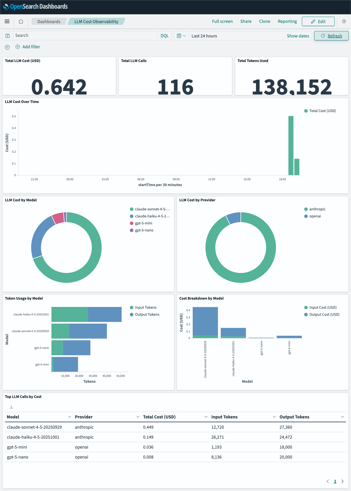
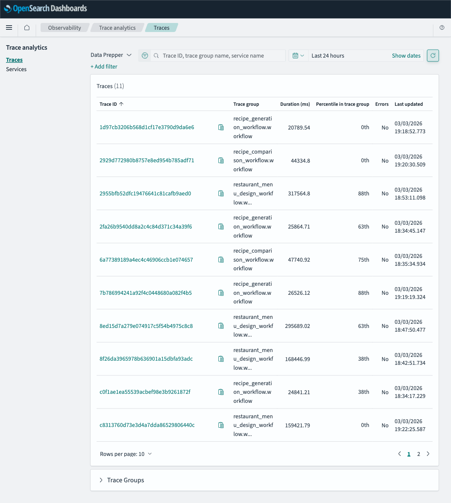
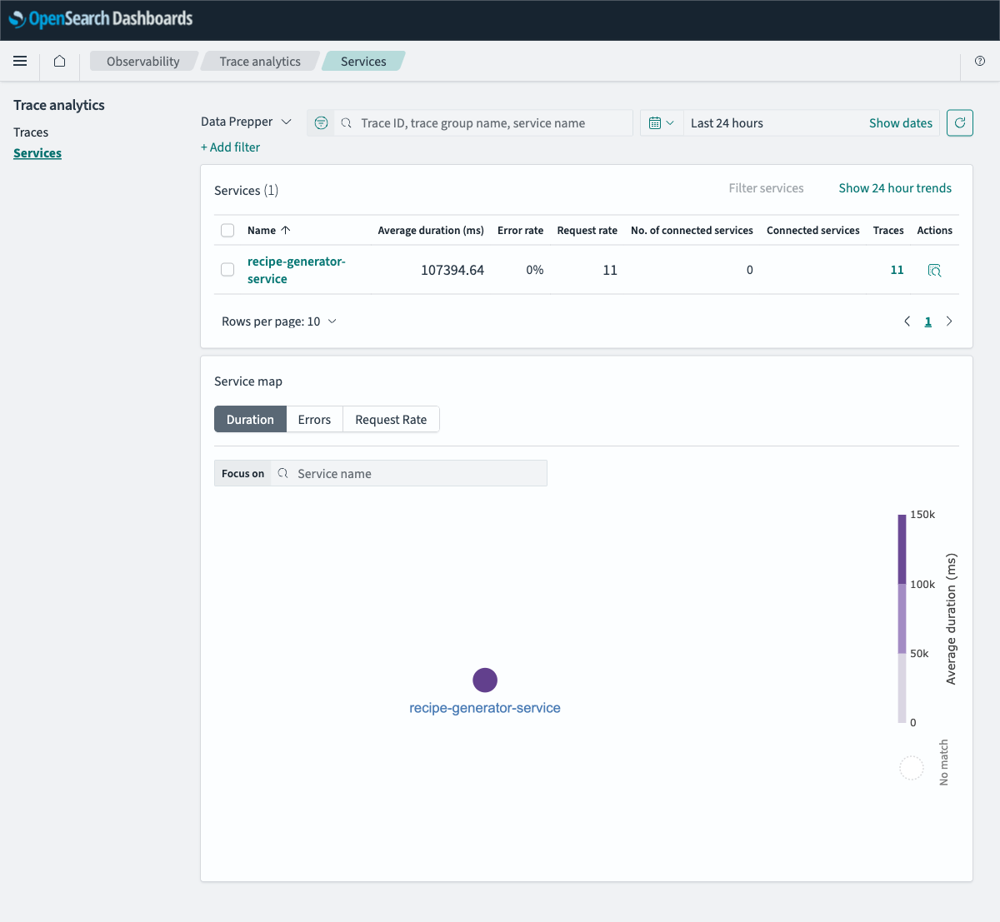
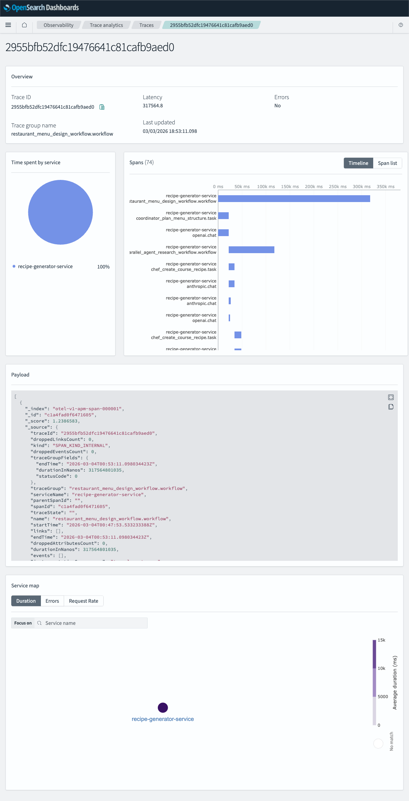
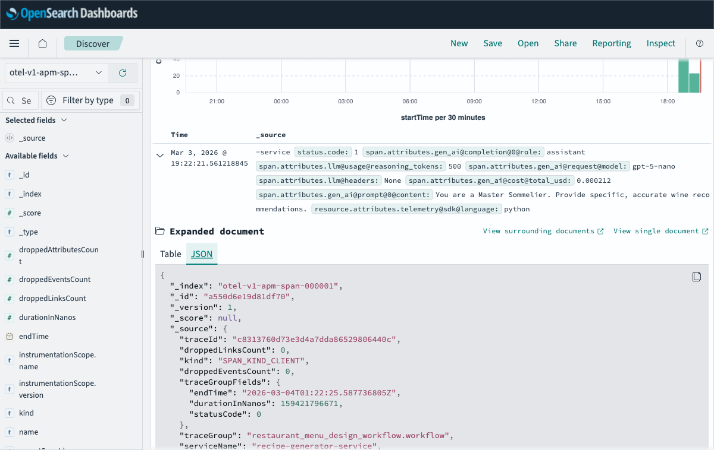
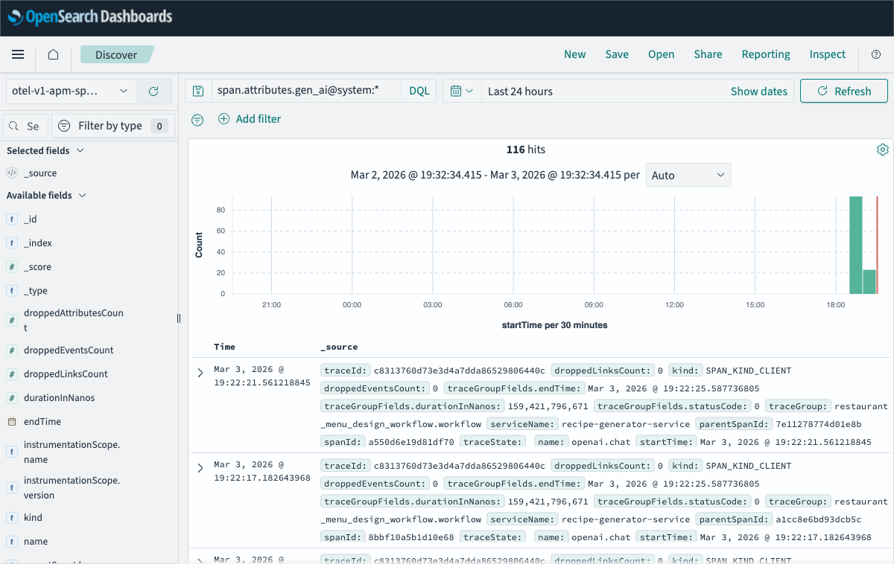

# LLM Observability with OpenSearch & OpenLLMetry



Full-stack LLM monitoring using OpenSearch, Data Prepper, and OpenTelemetry. Instruments LLM calls from Flask applications with zero code changes, enriches spans with real-time cost data, and visualizes everything in OpenSearch Dashboards.

This is the OpenSearch port of the [Elastic APM LLM Observability demo](https://maheshbabugorantla.github.io/posts/monitoring-llm-usage-elastic-apm-openllmetry/), adapted for the AWS-native observability stack.

---

## Features

- **Zero-code LLM instrumentation** — [OpenLLMetry](https://github.com/traceloop/openllmetry) instruments OpenAI and Anthropic calls automatically via `@workflow` / `@task` decorators
- **Automatic cost tracking** — `CostEnrichingSpanExporter` injects `gen_ai.cost.*` attributes using the LiteLLM pricing database (1,500+ models, auto-syncs every 24h)
- **9-panel cost dashboard** — Total cost, call count, token usage, cost over time, breakdown by model/provider, and top expensive calls
- **Multi-agent trace correlation** — Full trace waterfall across chained LLM calls with parent-child span relationships
- **One-command setup** — Docker Compose + Makefile for local development and demo

---

## Architecture

```
┌─────────────────────────────────────────────────────────────────────────┐
│ Flask App (localhost:5001)                                               │
│  - @workflow / @task decorators (OpenLLMetry)                           │
│  - CostEnrichingSpanExporter wraps OTLP exporter                       │
│  - Emits enriched OTLP spans with gen_ai.cost.* attributes             │
└────────────────────────────────┬────────────────────────────────────────┘
                                 │ OTLP/HTTP → http://otel-collector:4318
                                 ▼
┌─────────────────────────────────────────────────────────────────────────┐
│ OpenTelemetry Collector (localhost:4317/4318)                           │
│  - Receivers: OTLP gRPC + HTTP                                          │
│  - Processors: memory_limiter → resource → batch                       │
│  - Exports OTLP/gRPC to Data Prepper                                   │
└────────────────────────────────┬────────────────────────────────────────┘
                                 │ OTLP/gRPC → data-prepper:21890
                                 ▼
┌─────────────────────────────────────────────────────────────────────────┐
│ Data Prepper (localhost:21890)                                           │
│  - otel_trace_source: receives OTLP traces                              │
│  - otel_trace_raw: processes and indexes individual spans               │
│  - service_map: builds service dependency graph                         │
│  - Writes to: otel-v1-apm-span-*, otel-v1-apm-service-map             │
└────────────────────────────────┬────────────────────────────────────────┘
                                 │ REST API → http://opensearch:9200
                                 ▼
┌─────────────────────────────────────────────────────────────────────────┐
│ OpenSearch (localhost:9200)                                              │
│  - otel-v1-apm-span-* (raw spans with gen_ai.cost.* attributes)       │
│  - otel-v1-apm-service-map (service dependency graph)                  │
└────────────────────────────────┬────────────────────────────────────────┘
                                 │ Query API
                                 ▼
┌─────────────────────────────────────────────────────────────────────────┐
│ OpenSearch Dashboards (localhost:5601)                                   │
│  - Trace Analytics: service map, trace explorer, span details          │
│  - Custom LLM Cost Dashboard: cost by model, tokens, provider         │
└─────────────────────────────────────────────────────────────────────────┘
```

### Services

| Service | Image | Port(s) |
|---|---|---|
| OpenSearch | `opensearchproject/opensearch:2.17.1` | 9200, 9600 |
| OpenSearch Dashboards | `opensearchproject/opensearch-dashboards:2.17.1` | 5601 |
| Data Prepper | `opensearchproject/data-prepper:2.10.1` | 21890 (gRPC), 21891 (HTTP), 4900 (mgmt) |
| OTel Collector | `otel/opentelemetry-collector-contrib:0.91.0` | 4317 (gRPC), 4318 (HTTP) |
| Flask App | local build | 5001 |

> **Cost warning**: Running `make test` and `make test-multiagent` makes real API calls to OpenAI and Anthropic. Typical cost per full test run is under $0.10.

---

## Quick Start

### Prerequisites

- Docker and Docker Compose
- OpenAI and/or Anthropic API keys
- ~4GB RAM available for Docker

### Steps

```bash
# 1. Clone and configure
git clone https://github.com/maheshbabugorantla/llm-observability-opensearch
cd llm-observability-opensearch/opensearch
cp .env.example .env
# Edit .env and add your API keys

# 2. Start the stack (builds Flask image, starts all services)
make up

# 3. Apply numeric field type overrides — MUST run before first span
#    (Data Prepper defaults all span.attributes.* to keyword;
#     this overrides cost/token fields to float/long for aggregations)
make template

# 4. Generate traces (makes real LLM API calls)
make test

# 5. Import the LLM cost dashboard into OpenSearch Dashboards
make dashboard

# 6. Verify traces and cost data are present
make verify

# 7. Open dashboards
open http://localhost:5601/app/observability-traces
```

> **Order matters**: `make template` must run after `make up` but **before** `make test`. If you accidentally run `make test` first, `make template` will detect the wrong mapping and self-heal by recreating the index — but you will need to re-run `make test` and `make dashboard` afterwards to repopulate with correctly-typed data.

---

## Screenshots

### LLM Cost Dashboard


### Trace Analytics



### Service Map



### Trace Waterfall



### Span with Cost Attributes



### Discover LLM Spans



---

## API Endpoints

| Method | Path | Description |
|---|---|---|
| `GET` | `/health` | Health check |
| `POST` | `/recipe/generate` | Generate a recipe using a single LLM call |
| `POST` | `/recipe/compare` | Compare two recipes using parallel LLM calls |
| `POST` | `/recipe/batch` | Generate multiple recipes in batch |
| `POST` | `/menu/design` | Multi-agent menu design workflow (chained LLM calls) |

Example:

```bash
curl -X POST http://localhost:5001/recipe/generate \
  -H "Content-Type: application/json" \
  -d '{"dish": "pasta carbonara", "dietary_restrictions": "none"}'
```

---

## Captured Attributes

Every LLM span includes these attributes, visible in Trace Analytics and Discover:

| OTel Attribute | OpenSearch Field | Description |
|---|---|---|
| `gen_ai.system` | `span.attributes.gen_ai@system` | LLM provider (openai, anthropic) |
| `gen_ai.request.model` | `span.attributes.gen_ai@request@model` | Requested model name |
| `gen_ai.response.model` | `span.attributes.gen_ai@response@model` | Actual model used |
| `gen_ai.usage.input_tokens` | `span.attributes.gen_ai@usage@input_tokens` | Prompt tokens |
| `gen_ai.usage.output_tokens` | `span.attributes.gen_ai@usage@output_tokens` | Completion tokens |
| `gen_ai.cost.total_usd` | `span.attributes.gen_ai@cost@total_usd` | Total call cost in USD |
| `gen_ai.cost.input_usd` | `span.attributes.gen_ai@cost@input_usd` | Input cost in USD |
| `gen_ai.cost.output_usd` | `span.attributes.gen_ai@cost@output_usd` | Output cost in USD |
| `gen_ai.cost.model_resolved` | `span.attributes.gen_ai@cost@model_resolved` | Model used for pricing lookup |
| `gen_ai.cost.provider` | `span.attributes.gen_ai@cost@provider` | Provider used for pricing |

> **Note**: Data Prepper replaces dots (`.`) with `@` when flattening OTel span attributes into the indexed document. All queries and dashboard aggregations use `@` notation.

---

## Cost Tracking

Cost data is injected **client-side** before the span leaves the Flask process — no server-side enrichment needed.

**How it works**:

1. `Traceloop.init()` sets up OpenLLMetry tracing
2. `CostEnrichingSpanExporter` wraps the `BatchSpanProcessor` that Traceloop creates
3. On each span end, it reads `gen_ai.usage.input_tokens` and `gen_ai.usage.output_tokens`
4. Looks up the model's per-token price in the [LiteLLM pricing database](https://github.com/BerriAI/litellm/blob/main/model_prices_and_context_window.json) (auto-syncs every 24h)
5. Calculates input, output, and total cost and injects `gen_ai.cost.*` attributes
6. Forwards the enriched span to the OTLP exporter

This approach works with any backend — no changes required when switching from Elastic APM to OpenSearch.

**Confirming cost tracking is active** — look for this in Flask app logs:

```
LLM COST TRACKING SUCCESSFULLY ENABLED
```

---

## Index Template Override

### Why it's required

Data Prepper ships with a legacy index template that maps **all** fields under `span.attributes.*` as `keyword` via a catch-all dynamic rule. Keyword fields cannot be used in numeric aggregations (sum, average) in OpenSearch Dashboards — cost and token visualizations will show 0 or fail to render entirely.

### What `make template` does

`make template` runs `scripts/setup-index-template.sh`, which:

1. **Waits** for Data Prepper's ISM to create the backing index (`otel-v1-apm-span-000001`)
2. **Directly applies** explicit field type mappings to the index via `PUT /_mapping`

Explicit property mappings always take precedence over dynamic template rules within the same index, so when the first span arrives, the correct types are used.

Fields set to numeric types:

| Field | Type |
|---|---|
| `span.attributes.gen_ai@cost@total_usd` | `float` |
| `span.attributes.gen_ai@cost@input_usd` | `float` |
| `span.attributes.gen_ai@cost@output_usd` | `float` |
| `span.attributes.gen_ai@usage@input_tokens` | `long` |
| `span.attributes.gen_ai@usage@output_tokens` | `long` |
| `span.attributes.gen_ai@usage@total_tokens` | `long` |

Fields set to `keyword` (required for Terms aggregations in OSD):

| Field | Type |
|---|---|
| `span.attributes.gen_ai@system` | `keyword` |
| `span.attributes.gen_ai@request@model` | `keyword` |
| `span.attributes.gen_ai@response@model` | `keyword` |
| `span.attributes.gen_ai@cost@provider` | `keyword` |
| `span.attributes.gen_ai@cost@model_resolved` | `keyword` |

### When to run it

**After `make up`, before `make test`.** The script must run before any spans are indexed. Data Prepper's ISM creates the backing index on startup (before any spans arrive), so the window is: index exists and is empty.

The script is **self-healing**: if it detects the index already has incorrect field types (e.g., you ran `make test` first by mistake), it automatically deletes the index, restarts the `data-prepper` container so ISM recreates it, then applies the correct mappings to the fresh empty index.

> **Why not just use an index template?** OpenSearch 2.17.1 composable index templates (`_index_template`) do not reliably override the field types set by Data Prepper's legacy `_template` dynamic rules. The only reliable approach is a direct `PUT /_mapping` on the index itself.

---

## Project Structure

```
opensearch/
├── app/
│   ├── app.py                    # Flask application with OpenLLMetry decorators
│   ├── llm_cost_injector.py      # CostEnrichingSpanExporter + LiteLLM pricing
│   ├── Dockerfile
│   └── requirements.txt
├── dashboards/
│   └── llm-cost-dashboard.ndjson # 9-panel LLM cost dashboard (importable)
├── data-prepper/
│   ├── pipelines.yaml            # Trace pipeline configuration
│   └── data-prepper-config.yaml  # Server config (port, SSL)
├── scripts/
│   ├── test-api.sh               # API test suite (5 endpoints)
│   ├── test-multiagent.sh        # Multi-agent workflow test
│   ├── verify-traces.sh          # Verify spans + cost data in OpenSearch
│   ├── setup-dashboards.sh       # Import index patterns + NDJSON dashboard
│   └── setup-index-template.sh  # Apply numeric field type overrides
├── img/                          # Screenshots for README and slides
├── docker-compose.yml
├── otel-collector-config.yaml
├── Makefile
└── .env.example
```

---

## Makefile Reference

| Target | Description |
|---|---|
| `make up` | Build Flask image and start all 5 services |
| `make template` | Apply numeric field type overrides (run before `make test`) |
| `make test` | Run API test suite to generate traces |
| `make test-multiagent` | Run multi-agent workflow test |
| `make dashboard` | Import index patterns and LLM cost dashboard |
| `make verify` | Query OpenSearch to confirm spans and cost data |
| `make status` | Show container health, cluster health, span count |
| `make logs` | Tail Flask app logs |
| `make logs-dataprepper` | Tail Data Prepper logs |
| `make logs-collector` | Tail OTel Collector logs |
| `make down` | Stop all containers (data preserved) |
| `make clean` | Stop all containers and delete all volumes |

---

## Troubleshooting

### Dashboard shows "No results" or cost panels show errors/0

**Most likely cause**: `make template` was not run before `make test`, so cost fields were indexed as `keyword`.

Since `make template` is self-healing, just run it now — it will detect the wrong mapping, recreate the index, and fix the field types automatically:

```bash
make template     # detects + fixes wrong field types automatically
make test         # re-generate spans with correct types
make dashboard    # re-import dashboard and refresh field list
```

If that doesn't help, start completely fresh:

```bash
make clean && make up && make template && make test && make dashboard
```

Also check the time range — OpenSearch Dashboards defaults to "Last 15 minutes". Widen it to "Last 1 hour" or "Last 24 hours".

### No spans in OpenSearch

Check the data flow:

```bash
# Is Data Prepper running?
curl http://localhost:4900/list/pipelines

# Any errors in Data Prepper?
make logs-dataprepper

# Did OTel Collector receive spans?
make logs-collector

# Are there any indices at all?
curl http://localhost:9200/_cat/indices/otel-v1-apm-*?v
```

Common cause: OTel Collector exports to port 21890 (gRPC), not 21891 (HTTP). Verify `otel-collector-config.yaml` uses `data-prepper:21890`.

### Cost attributes missing from spans

Look for this log line in the Flask app:

```bash
make logs | grep "COST TRACKING"
```

If `LLM COST TRACKING SUCCESSFULLY ENABLED` is absent, `CostEnrichingSpanExporter` failed to initialize. Check for import errors in `llm_cost_injector.py`.

### Trace Analytics page is empty

Trace Analytics requires the `otel_trace_group` processor in Data Prepper to work correctly. Verify `pipelines.yaml` includes it. Also run `make dashboard` to ensure index patterns are created.

### OpenSearch container unhealthy

```bash
docker compose logs opensearch --tail=30
```

Common cause: not enough memory. The container requires at least 1GB. Check `OPENSEARCH_JAVA_OPTS=-Xms512m -Xmx512m` in `docker-compose.yml` and ensure Docker has at least 4GB RAM allocated.

### "Index not found" errors after `make clean`

After deleting volumes, Data Prepper recreates indices on the next span. If you see alias errors, restart Data Prepper:

```bash
docker compose restart data-prepper
```

---

## Stopping the Stack

```bash
# Stop containers but preserve OpenSearch data
make down

# Stop and delete everything (data, volumes, indices)
make clean
```

---

## References

- [OpenSearch Trace Analytics](https://opensearch.org/docs/latest/observing-your-data/trace/index/)
- [Data Prepper Trace Analytics Pipeline](https://opensearch.org/docs/latest/data-prepper/pipelines/configuration/processors/otel-trace-raw/)
- [OpenLLMetry (Traceloop)](https://github.com/traceloop/openllmetry)
- [OTel GenAI Semantic Conventions](https://opentelemetry.io/docs/specs/semconv/gen-ai/)
- [Amazon OpenSearch Service](https://aws.amazon.com/opensearch-service/)
- [Amazon OpenSearch Ingestion](https://aws.amazon.com/opensearch-service/features/integration/)
- [Original Elastic APM Blog Post](https://maheshbabugorantla.github.io/posts/monitoring-llm-usage-elastic-apm-openllmetry/)
